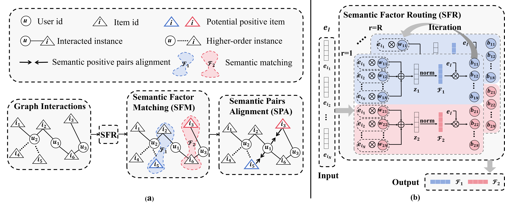

# SaFeAU




Implementation of the paper "[Beyond Instance-Level Alignment and Uniformity: Semantic Factor Learning for Collaborative Filtering]" in KDD'26.


We integrate our method SaFeAU into the [RecBole](https://recbole.io/) framework. Our implementation is built upon the [DirectAU](https://github.com/THUwangcy/DirectAU/blob/main/recbole/model/general_recommender/directau.py) architecture, inheriting its loss function that explicitly optimizes for both Alignment and Uniformity.


```shell
# Gowalla
python run_recbole.py --model=SaFeAU --dataset=Gowalla --gamma1=10 --gamma2=0.1 --K=4 --top_k=2 --t=3 --encoder=MF --train_batch_size=1024

# Toys-and-Games
python run_recbole.py --model=SaFeAU --dataset=Toys-and-Games --gamma1=0.5 --gamma2=0.1 --K=4 --top_k=2 --t=0.8 --encoder=MF --train_batch_size=1024

# Beauty
python run_recbole.py --model=SaFeAU --dataset=Beauty --gamma1=0.5 --gamma2=0.1 --K=4 --top_k=2 --t=1.8 --encoder=MF --train_batch_size=256

'''
